# Diagrama Base de Datos EISESA / Torre Control CyR

## 1. Resumen General
La base de datos de Torre Control CyR está diseñada de manera relacional para gestionar la programación, asignación y el control de resultados diarios de las brigadas en terreno. Actualmente soporta brigadas de tipo PXQ (Pago por Cantidad) y CF (Corte Fijo). La arquitectura está fuertemente orientada a operaciones diarias (almacenando datos por `fecha_operacional` y `zona`). Recientemente se han refactorizado tablas para unificar el control de brigadas PXQ y CF añadiendo una columna `tipo_brigada` a las tablas centrales, aunque **siguen activas y en paralelo** las tablas específicas de CF.

*Nota:* Actualmente, **no existen claves foráneas (FK) formales a nivel de esquema en la base de datos**. Todas las relaciones se manejan de manera "lógica" a nivel de aplicación (vinculando por `fecha_operacional`, `zona`, `usuario`, o `tipo_brigada`).

## 2. Diagrama ER

```mermaid
erDiagram
    reportes_cyr {
        int id PK
        date fecha_operacional UK
        string estado
    }

    control_brigadas_diario {
        int id PK
        date fecha_operacional
        string zona
        string tipo_brigada
        string usuario
        string codigo_sap
        string patente
        string estado_brigada
        time hora_primer_movimiento
        int corte_programado
        int reconexiones_ejecutadas
        time primer_corte
        time ultimo_corte
        int corte_en_poste
        int corte_en_empalme
        int visita_fallida
    }

    control_programacion_zona {
        int id PK
        date fecha_operacional UK
        string zona UK
        string tipo_brigada UK
        int reconexiones_programadas
        int asignacion_carga
        int corte_programado
    }

    control_parametros_zona {
        int id PK
        string zona UK
        string tipo_brigada UK
        int brigadas_contrato
        boolean activo
    }

    control_parametros_generales {
        int id PK
        int meta_diaria_cortes_brigada
        time hora_inicio_jornada
    }

    control_resultados_reales_zona {
        int id PK
        date fecha_operacional UK
        string zona UK
        int total_reconexiones_ejecutadas
        int total_cortes
    }
    
    control_parametros_cf_generales {
        int id PK
        int meta_diaria_cortes_brigada
    }

    control_parametros_cf_zona {
        int id PK
        string zona UK
        int brigadas_cf_contrato
    }

    control_programacion_cf_zona {
        int id PK
        date fecha_operacional UK
        string zona UK
        int reconexiones_programadas
    }

    dim_tipo_brigada_usuario {
        int id PK
        string usuario_normalizado UK
        string tipo_brigada
    }

    control_supervisores {
        int id PK
        string nombre
        boolean activo
    }

    control_supervisor_comunas_zonas {
        int id PK
        int supervisor_id FK
        string comuna
        string zona_principal
        boolean activo
    }

    control_supervisor_usuarios_sap {
        int id PK
        int supervisor_id FK
        string codigo_sap
        string cuenta
        string tipo_brigada
        boolean activo
    }

    %% Relaciones Lógicas (No hay FKs físicos en la BD, se unen por aplicación)
    reportes_cyr ||--o{ control_brigadas_diario : "fecha_operacional (Relación Lógica)"
    reportes_cyr ||--o{ control_programacion_zona : "fecha_operacional (Relación Lógica)"
    reportes_cyr ||--o{ control_resultados_reales_zona : "fecha_operacional (Relación Lógica)"
    control_parametros_zona ||--o{ control_programacion_zona : "zona, tipo_brigada (Relación Lógica)"
    dim_tipo_brigada_usuario ||--o{ control_brigadas_diario : "usuario_normalizado == usuario (Relación Lógica)"

    %% Relaciones Supervisor
    control_supervisores ||--o{ control_supervisor_comunas_zonas : "supervisor_id"
    control_supervisores ||--o{ control_supervisor_usuarios_sap : "supervisor_id"
```

## 3 a 7. Diccionario de Tablas (Detalle y Relaciones)

### `reportes_cyr`
**Propósito:** Controla el estado general del reporte gerencial para un día operativo.
- **Clave Primaria:** `id`
- **Claves Únicas:** `fecha_operacional`
- **Columnas Principales:** `fecha_operacional` (Date), `estado` (String, default: 'borrador').
- **Relaciones:** Lógica con demás tablas a través de `fecha_operacional`.

### `control_brigadas_diario`
**Propósito:** Almacena el detalle individual de cada brigada (vehículo y técnico) operando en el día.
- **Clave Primaria:** `id`
- **Claves Únicas:** Ninguna.
- **Columnas Principales:** `fecha_operacional`, `zona`, `usuario`, `codigo_sap`, `patente`, `tipo_brigada` (PXQ o CF), `estado_brigada`, `hora_primer_movimiento`, `corte_programado` (es una columna real que viene de la programación del supervisor), `reconexiones_ejecutadas`, `primer_corte`, `ultimo_corte`, `corte_en_poste`, `corte_en_empalme`, `visita_fallida`, además de acumulados horarios (`acum_09` a `acum_14`).
- **Relaciones:** Lógica a `reportes_cyr` (fecha) y a `dim_tipo_brigada_usuario` (`usuario`).

### `control_programacion_zona`
**Propósito:** Registra la carga y metas programadas (cortes, reconexiones) consolidadas por zona y tipo de brigada para una fecha específica.
- **Clave Primaria:** `id`
- **Claves Únicas:** (`fecha_operacional`, `zona`, `tipo_brigada`).
- **Columnas Principales:** `reconexiones_programadas`, `asignacion_carga`, `corte_programado`.
- **Relaciones:** Lógica con `control_parametros_zona` mediante `zona` y `tipo_brigada`.

### `control_parametros_zona`
**Propósito:** Definir configuración estática como la cantidad de brigadas contratadas esperadas en una zona, divididas por tipo.
- **Clave Primaria:** `id`
- **Claves Únicas:** (`zona`, `tipo_brigada`).
- **Columnas Principales:** `brigadas_contrato`, `activo`.

### `control_parametros_generales`
**Propósito:** Mantener métricas estándar del negocio (horarios de jornada, meta diaria global).
- **Clave Primaria:** `id`
- **Columnas Principales:** `meta_diaria_cortes_brigada`, `hora_inicio_jornada`, `hora_cierre_jornada`.

### `control_resultados_reales_zona`
**Propósito:** Consolidación final y totales ejecutados por zona en un día específico. **Sí está activamente en uso en el backend (vía `resultado_real_zona_repository.py`)**. 
- **Clave Primaria:** `id`
- **Claves Únicas:** (`fecha_operacional`, `zona`).
- **Columnas Principales:** `total_reconexiones_ejecutadas`, `total_cortes`, acumulados por hora.

### `dim_tipo_brigada_usuario`
**Propósito:** Dimensión introducida para identificar automáticamente a los usuarios especialistas de CF frente a los regulares PXQ.
- **Clave Primaria:** `id`
- **Claves Únicas:** `usuario_normalizado`.
- **Columnas Principales:** `tipo_brigada`, `activo`.
- **Relaciones:** Lógica con `control_brigadas_diario.usuario`.

### Tablas Específicas de CF (Activas y en Paralelo)
- **`control_parametros_cf_generales`**
- **`control_parametros_cf_zona`**
- **`control_programacion_cf_zona`** (legacy temporal)
**Propósito:** Estas tablas administraban parámetros y programación separada exclusivamente para brigadas Corte Fijo (CF). Desde Stage 7, `control_programacion_zona` con `tipo_brigada='CF'` es la tabla oficial. Las tablas legacy se conservan temporalmente pero ya no son fuente principal.

> **Actualización Stage 7:** Se ejecutó backfill de `control_programacion_cf_zona` → `control_programacion_zona` con `tipo_brigada='CF'`. El nuevo flujo es: el frontend escribe en `control_programacion_zona` y el backend la lee como fuente única para ambos tipos de brigada.

### Tablas de Configuración de Supervisor
- **`control_supervisores`**: Almacena el catálogo de supervisores del sistema.
- **`control_supervisor_comunas_zonas`**: Mapeo configurado por supervisor entre comunas locales (ej: Coronel) y la zona principal operativa (ej: Concepción).
- **`control_supervisor_usuarios_sap`**: Mapeo configurado por supervisor entre código SAP, nombre de cuenta y tipo de brigada asignada.

## 8. Flujo de Datos Principal

1. **Inicio del día:** Se crea/inicializa la entrada en `reportes_cyr` utilizando la `fecha_operacional` de hoy en estado 'borrador'. Se leen los `control_parametros_zona` y `control_parametros_cf_zona` para proyectar el esfuerzo esperado del día.
2. **Brigadas del día:** Los datos de asistencia y asignación de personal ingresan a `control_brigadas_diario`. El sistema cruza al usuario asignado con la tabla `dim_tipo_brigada_usuario` para etiquetar correctamente la fila como `PXQ` o `CF`.
3. **Programación diaria:** El coordinador registra la meta y la asignación de carga consolidada en `control_programacion_zona` para PXQ y CF (diferenciados por `tipo_brigada`). La tabla legacy `control_programacion_cf_zona` ya no es fuente principal desde Stage 7.
4. **Reporte gerencial:** Durante la jornada, se registran resultados acumulados por horas y visitas efectivas. Estos resultados parciales por individuo se actualizan en `control_brigadas_diario`, y los totales de zona se calculan/guardan en `control_resultados_reales_zona`. Al final, se puede cerrar el día en `reportes_cyr`.

## 9. Observaciones y Riesgos
- **Relaciones Lógicas (Ausencia de FK):** Al no haber `FOREIGN KEY` físicas en la base de datos (todo se une por `zona` (string) o `fecha_operacional` (date) a nivel de repositorio), cualquier discrepancia ortográfica o mayúsculas genera registros "huérfanos" (e.g. "Iquique" vs "iquique").
- **Doble Fuente de Verdad (PXQ vs CF):** El sistema mantiene la estructura inicial de tablas para CF en paralelo con las tablas base refactorizadas (que ya cuentan con el campo `tipo_brigada`). Esto crea un doble estándar que requiere mantener el código sincronizado en distintos repositorios.

## 10. Mejoras Recomendadas para Etapa Futura
1. **Implementar Integridad Referencial:** Agregar `FOREIGN KEY` reales de base de datos desde `control_brigadas_diario` y las de programación apuntando a un maestro `reportes_cyr` y maestros dimensionales (`dim_zona`, `dim_usuario`).
2. **Consolidar Tablas CF:** (Completado Stage 7) Los datos de programación CF fueron migrados desde `control_programacion_cf_zona` hacia `control_programacion_zona` con `tipo_brigada='CF'`. `control_programacion_zona` es ahora la tabla oficial para PXQ y CF. Pendiente retiro futuro de tablas legacy `control_programacion_cf_zona`, `control_parametros_cf_zona` y `control_parametros_cf_generales`.
